# JAVAEE作业汇报

成员：
20301172 王诗涵
20301102 景驰原

作业分支：

第一次作业：master

第二次作业：uploadTest

第三次作业：JAVAEE_V3

第四次作业：JAVAEE_V4

[toc]


## 一、四次作业要求完成情况详情清单

本部分以列表形式展示作业要求完成情况，并在括号内具体说明。

### 1、作业一

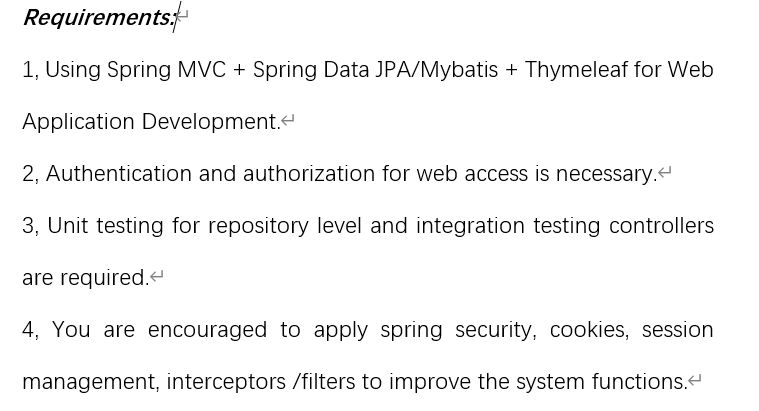

- [x] Using Spring MVC + Spring Data JPA/Mybatis + Thymeleaf for Web Application Development.（We use  Spring MVC + Mybatis + Thymeleaf）
- [x] Authentication and authorization for web access is necessary.(We use Spring Security and JWT)
- [x] Unit testing for repository level and integration testing controllers are required.(We use JUnit,the screenshots and code also have);
- [x] You are encouraged to apply spring security, cookies, session management, interceptors /filters to improve the system functions.(We use Spring Security、session management and filters )

**作业完成思路**

> 本次作业是一次前后端不分离的SpringMVC作业，项目采用SSM框架，并使用了Thymeleaf 作为解析器。同时，我们也采用了Spring Security、JWT、session management和一些filter进行鉴权，采用对登录、注册放行，拦截其余请求的策略进行验证。同时，由于Spring Security的鉴权功能，我们可以使普通用户（ROLE）和管理员（ADMIN）登陆后进入不同界面。本次作业在业务上较为简单，但功能涉及全面。

### 2、作业二

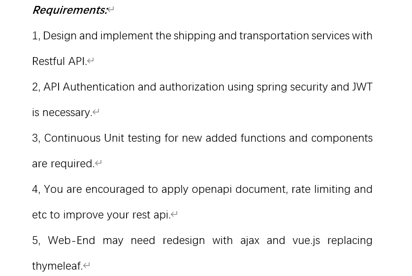

- [x] Design and implement the shipping and transportation services with Restful API.(We use Restful API)
- [x] API Authentication and authorization using spring security and JWT is necessary.(We use Spring Security and JWT)
- [x] Continuous Unit testing for new added functions and components are required.(We also use JUnit)
- [ ] You are encouraged to apply openapi document, rate limiting and etc to improve your rest api.
- [x] Web-End may need redesign with ajax and vue.js replacing thymeleaf(We use axios and vue.js)

**作业完成思路**

> 本次作业在第一次作业的基础上，采用vue.js进行了前后端分离。在前端页面效果上基本保留了第一次作业的风格，技术栈改为vue.js和axios发送请求。在安全验证上，我们仍然使用了Spring Security 和JWT。接口设计风格上，我们采用了Restful API的风格，并将后端改为spring boot实现，省去了model and view。功能与第一次大体相似。

### 3、作业三

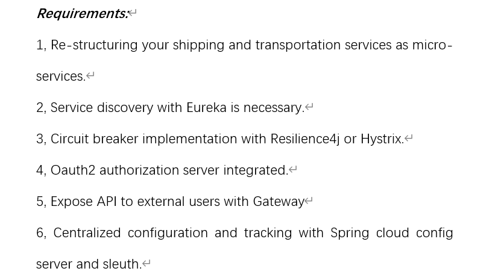

- [x] Re-structuring your shipping and transportation services as micro-services.（We use Nacos to Re-structuring our shipping and transportation services as micro-services ）
- [x]  Service discovery with Eureka is necessary.(We use Nacos to discovery service )
- [x] Circuit breaker implementation with Resilience4j or Hystrix.(We use feign to implement Hystrix,we give them a fallback function)
- [x] Oauth2 authorization server integrated.(We use spring webflux security to replace servlet)
- [x] Expose API to external users with Gateway（We use gateway with nacos）
- [x] Centralized configuration and tracking with Spring cloud config server and sleuth.（We use redis to replace spring cloud config to have jwt with auth-server and gateway-server and we use Logback to record）

**作业完成思路**

> 本次作业在第二次作业的基础上，将spring boot后端改造为微服务应用。并重新设计了业务层次，使流程更加标准和规范。我们使用了阿里巴巴的Nacos实现了这次作业的微服务。并使用Nacos进行服务发现和注册。在熔断和限流上，我们使用sentinel实现了限流，利用feign实现了hystrix熔断。我们也添加了网关，使用了Nacos gateway，对请求进行统一鉴权和转发，利用feign client进行服务间通信，同时利用Fallback机制，使得服务可以降级。鉴权策略上，我们添加了Auth-server进行前两次作业的jwt和springsecurity工作，在gateway中对auth-server生成的token进行检验。由于gateway底层是webflux，而前两次作业的springsecurity则是基于servlet的，因此，在改造鉴权的过程中遇到了很多麻烦。感谢老师上课时提醒的WebFlux和Servlet的冲突，最终我们意识到了这个问题，并在网关中重新配置，使用了Spring WebFlux Security，成功解决了鉴权问题。同时，通过网关过滤器，成功拦截其他请求而对登录请求放行。在jwt secret传递时，我们通过redis缓存进行读取，代替了Spring cloud config，也克服了网关和auth-server传递的问题。综合来说，这次作业让我们对微服务和鉴权问题有了更深的理解

### 4、作业四

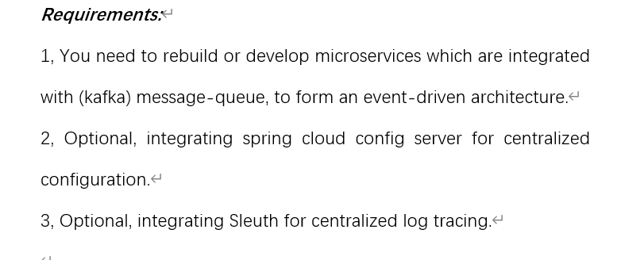

- [x] You need to rebuild or develop microservices which are integrated with (kafka) message-queue, to form an event-driven architecture.（We use kafka）
- [x] Optional, integrating spring cloud config server for centralized configuration.(Using redis to replace)
- [ ] Optional, integrating Sleuth for centralized log tracing(Use log4j-logback but no tracing?)

**作业完成思路**

> 本次作业在第三次作业的基础上，将微服务间使用Feign Client通信的策略改为了使用kafka进行通信。我们将原本微服务的外部接口作业kafka的生产者，每当被请求就会发送消息。将原本的微服务间的内部接口改为了kafka的消费者，接收生产者的请求，并将消息发送到response中，我们在每个controller中利用一个listener去监听这些回复。由于kafka多重消费的问题，我们使用了CompletableFuture使得每个消息只会被消费一次（通过设置唯一的requestId）,同时，也能在请求未被消费时阻塞进程，请求成功后唤醒。其余两点仍然延续第三次作业。

## 二、系统整体设计

### 1、主业务流程

系统主体业务流程如下图：

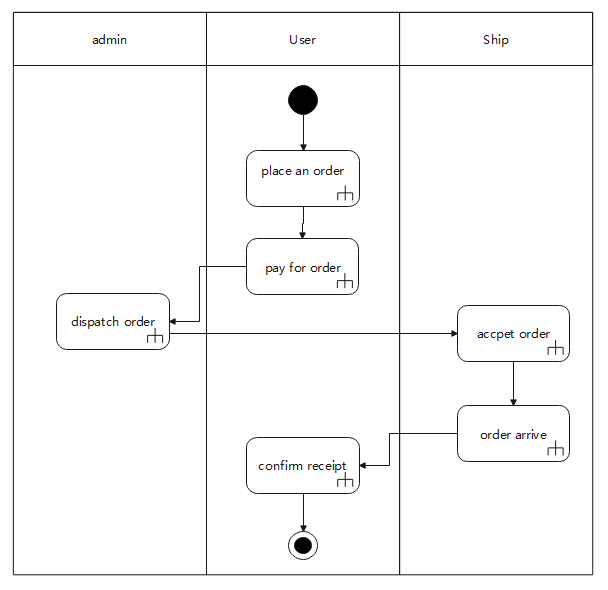


其中，订单生命周期与行为图如下:

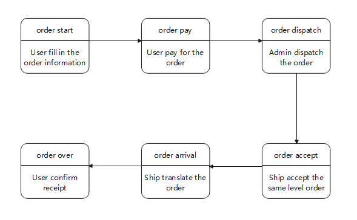

由于第一二次作业为简化版，业务部分省略了其中支付、接收等流程。

### 2、数据库设计

项目最终数据库设计物理模型如下：

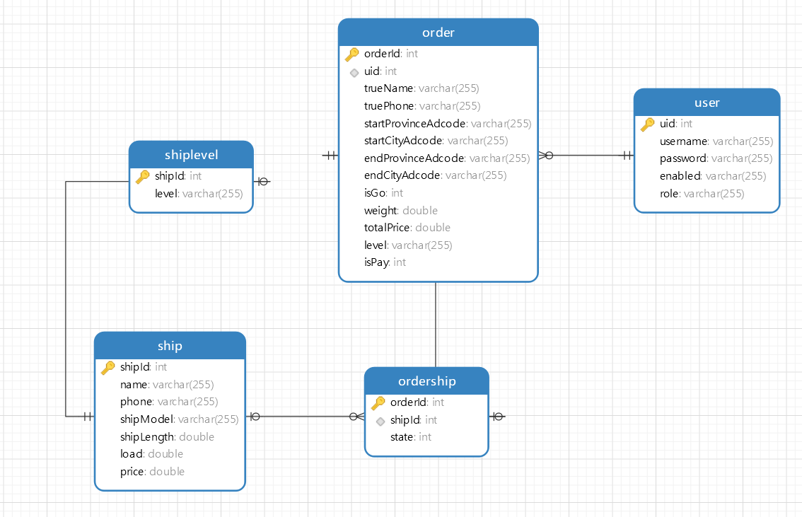

逻辑模型如下：

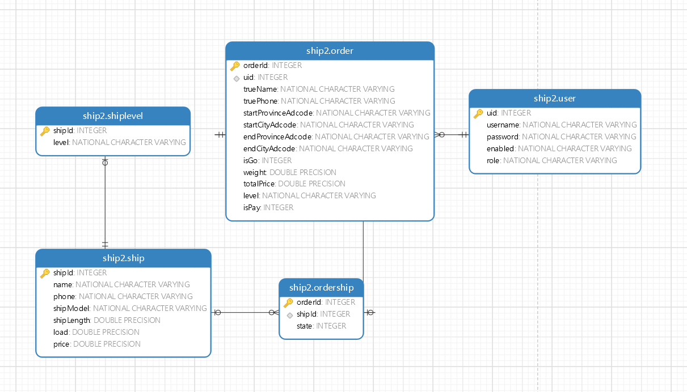

由于前两次作业为简化版，因此模型略有不同，详情可见数据库文件ship.sql。（最终数据库文件为ship2.sql）

### 3、接口设计

本部分接口设计以第三次作业为例，包含了微服务间调用的接口。关于接口的描述与测试可见后续postman测试部分。

#### 1	环境变量

**默认环境**

| 参数名  | 字段值                |
| ------- | --------------------- |
| baseUrl | http://localhost:8080 |


#### 2	Api Documentation

**说明**

> 网关端口8080，通过网关转发至下列微服务
>
> 以下请求中，“外部接口”声明的即为暴露的API，可被请求使用，“微服务间调用”声明的为微服务之间互相通信使用的接口，未经解析，一般来说与外部不同，仅供参考。
>
> 第四次作业kafka的使用中，保留了外部接口，微服务间调用的内部接口采用KafkaListener进行接收。外部接口作为生产者，内部接口作为消费者，并使用CompletableFuture确保了服务不会被重复消费。

**文档版本**

```
1.0
```


#### 3	User Controller

##### 3.1	外部接口-用户支付

> POST  /user-server/payOrder/{orderId}

**地址参数（Path Variable）**

| 参数名称 | 默认值 | 描述   |
| -------- | ------ | ------ |
| orderId  |        | 订单id |

**响应体**

● 200 响应数据格式：JSON

| 参数名称   | 类型    | 默认值 | 不为空 | 描述                             |
| ---------- | ------- | ------ | ------ | -------------------------------- |
| data       | object  |        | false  |                                  |
| flag       | boolean |        | false  |                                  |
| msg        | string  |        | false  |                                  |
| statusCode | int32   | 200    | false  | the http code 200、404 and so on |


##### 3.2	外部接口-用户下单

> POST  /user-server/saveOrder

**响应体**

● 200 响应数据格式：JSON

| 参数名称   | 类型    | 默认值 | 不为空 | 描述                             |
| ---------- | ------- | ------ | ------ | -------------------------------- |
| data       | object  |        | false  |                                  |
| flag       | boolean |        | false  |                                  |
| msg        | string  |        | false  |                                  |
| statusCode | int32   | 200    | false  | the http code 200、404 and so on |

**接口描述**

> 需传递Order实体


##### 3.3	外部接口-用户确认订单接收

> POST  /user-server/over/{orderId}

**地址参数（Path Variable）**

| 参数名称 | 默认值 | 描述   |
| -------- | ------ | ------ |
| orderId  |        | 订单id |

**响应体**

● 200 响应数据格式：JSON

| 参数名称   | 类型    | 默认值 | 不为空 | 描述                             |
| ---------- | ------- | ------ | ------ | -------------------------------- |
| data       | object  |        | false  |                                  |
| flag       | boolean |        | false  |                                  |
| msg        | string  |        | false  |                                  |
| statusCode | int32   | 200    | false  | the http code 200、404 and so on |


##### 3.4	微服务间接口-根据页号获得所有用户

> GET  /user-server/getAllUser/{pageNum}

**地址参数（Path Variable）**

| 参数名称 | 默认值 | 描述 |
| -------- | ------ | ---- |
| pageNum  |        | 页号 |

**响应体**

● 200 响应数据格式：JSON


##### 3.5	外部接口-根据页号获取所有货船

> GET  /user-server/getAllShips/{pageNum}

**地址参数（Path Variable）**

| 参数名称 | 默认值 | 描述 |
| -------- | ------ | ---- |
| pageNum  |        | 页号 |

**响应体**

● 200 响应数据格式：JSON

| 参数名称   | 类型    | 默认值 | 不为空 | 描述                             |
| ---------- | ------- | ------ | ------ | -------------------------------- |
| data       | object  |        | false  |                                  |
| flag       | boolean |        | false  |                                  |
| msg        | string  |        | false  |                                  |
| statusCode | int32   | 200    | false  | the http code 200、404 and so on |


#### 4	Ship Controller

##### 4.1	外部接口-货船接受调派

> POST  /ship-server/accept/{orderId}/{shipId}

**地址参数（Path Variable）**

| 参数名称 | 默认值 | 描述   |
| -------- | ------ | ------ |
| orderId  |        | 订单id |

**响应体**

● 200 响应数据格式：JSON

| 参数名称   | 类型    | 默认值 | 不为空 | 描述                             |
| ---------- | ------- | ------ | ------ | -------------------------------- |
| data       | object  |        | false  |                                  |
| flag       | boolean |        | false  |                                  |
| msg        | string  |        | false  |                                  |
| statusCode | int32   | 200    | false  | the http code 200、404 and so on |


##### 4.2	外部接口-货船到达目的地

> POST  /ship-server/arrival/{orderId}

**地址参数（Path Variable）**

| 参数名称 | 默认值 | 描述   |
| -------- | ------ | ------ |
| orderId  |        | 订单id |

**响应体**

● 200 响应数据格式：JSON

| 参数名称   | 类型    | 默认值 | 不为空 | 描述                             |
| ---------- | ------- | ------ | ------ | -------------------------------- |
| data       | object  |        | false  |                                  |
| flag       | boolean |        | false  |                                  |
| msg        | string  |        | false  |                                  |
| statusCode | int32   | 200    | false  | the http code 200、404 and so on |


##### 4.3	微服务间接口-根据页号获取所有船只

> GET  /ship-server/getAllShips/{pageNum}

**地址参数（Path Variable）**

| 参数名称 | 默认值 | 描述 |
| -------- | ------ | ---- |
| pageNum  |        | 页号 |

**响应体**

● 200 响应数据格式：JSON


##### 5.4	微服务间接口-获取船只详情,需传递订单id

> GET  /ship-server/getDetail/{shipId}

**地址参数（Path Variable）**

| 参数名称 | 默认值 | 描述   |
| -------- | ------ | ------ |
| shipId   |        | 船只id |

**响应体**

● 200 响应数据格式：JSON


##### 4.5	微服务间接口-获取对应等级的船只

> GET  /ship-server/getShipsByLevel/{level}

**地址参数（Path Variable）**

| 参数名称 | 默认值 | 描述     |
| -------- | ------ | -------- |
| level    |        | 船只等级 |

**响应体**

● 200 响应数据格式：JSON


#### 5	Admin Controller


##### 5.1	外部接口-根据页号获取所有船只

> GET  /admin-server/getAllShips/{pageNum}

**地址参数（Path Variable）**

| 参数名称 | 默认值 | 描述 |
| -------- | ------ | ---- |
| pageNum  |        | 页号 |

**响应体**

● 200 响应数据格式：JSON

| 参数名称   | 类型    | 默认值 | 不为空 | 描述                             |
| ---------- | ------- | ------ | ------ | -------------------------------- |
| data       | object  |        | false  |                                  |
| flag       | boolean |        | false  |                                  |
| msg        | string  |        | false  |                                  |
| statusCode | int32   | 200    | false  | the http code 200、404 and so on |


##### 5.2	外部接口-获取所有用户

> GET  /admin-server/getAllUser/{pageNum}

**地址参数（Path Variable）**

| 参数名称 | 默认值 | 描述 |
| -------- | ------ | ---- |
| pageNum  |        | 页号 |

**响应体**

● 200 响应数据格式：JSON

| 参数名称   | 类型    | 默认值 | 不为空 | 描述                             |
| ---------- | ------- | ------ | ------ | -------------------------------- |
| data       | object  |        | false  |                                  |
| flag       | boolean |        | false  |                                  |
| msg        | string  |        | false  |                                  |
| statusCode | int32   | 200    | false  | the http code 200、404 and so on |


##### 5.3	外部接口-派遣船只接收订单

> POST  /admin-server/dispatch/{orderId}/{shipId}

**地址参数（Path Variable）**

| 参数名称 | 默认值 | 描述    |
| -------- | ------ | ------- |
| orderId  |        | orderId |

**响应体**

● 200 响应数据格式：JSON

| 参数名称   | 类型    | 默认值 | 不为空 | 描述                             |
| ---------- | ------- | ------ | ------ | -------------------------------- |
| data       | object  |        | false  |                                  |
| flag       | boolean |        | false  |                                  |
| msg        | string  |        | false  |                                  |
| statusCode | int32   | 200    | false  | the http code 200、404 and so on |


##### 5.4	外部接口-获取所有未派遣订单

> GET  /admin-server/getNoGo

**响应体**

● 200 响应数据格式：JSON

| 参数名称   | 类型    | 默认值 | 不为空 | 描述                             |
| ---------- | ------- | ------ | ------ | -------------------------------- |
| data       | object  |        | false  |                                  |
| flag       | boolean |        | false  |                                  |
| msg        | string  |        | false  |                                  |
| statusCode | int32   | 200    | false  | the http code 200、404 and so on |


#### 6	Order Controller

##### 6.1	微服务间接口-货船接收订单

> POST  /order-server/accept/{orderId}/{shipId}

**地址参数（Path Variable）**

| 参数名称 | 默认值 | 描述    |
| -------- | ------ | ------- |
| orderId  |        | orderId |

**响应体**

● 200 响应数据格式：JSON


##### 6.2	微服务间接口-船只到达目的地，需传递订单号

> POST  /order-server/arrival/{orderId}

**地址参数（Path Variable）**

| 参数名称 | 默认值 | 描述   |
| -------- | ------ | ------ |
| orderId  |        | 订单id |

**响应体**

● 200 响应数据格式：JSON


##### 6.3	微服务间接口-将指定订单分给指定的船只

> POST  /order-server/dispatch/{orderId}/{shipId}

**地址参数（Path Variable）**

| 参数名称 | 默认值 | 描述   |
| -------- | ------ | ------ |
| orderId  |        | 订单id |

**响应体**

● 200 响应数据格式：JSON


##### 6.4	微服务间接口-获取已支付但未被派遣的订单

> GET  /order-server/getNoGo

**响应体**

● 200 响应数据格式：JSON


##### 6.5	微服务间接口-用户确认，结束订单

> POST  /order-server/over/{orderId}/

**地址参数（Path Variable）**

| 参数名称 | 默认值 | 描述   |
| -------- | ------ | ------ |
| orderId  |        | 订单id |

**响应体**

● 200 响应数据格式：JSON


##### 6.6	微服务间接口-支付订单,需传递订单id

> POST  /order-server/payOrder/{orderId}

**地址参数（Path Variable）**

| 参数名称 | 默认值 | 描述   |
| -------- | ------ | ------ |
| orderId  |        | 订单id |

**响应体**

● 200 响应数据格式：JSON


##### 6.7	微服务间接口-保存订单,需传递订单实体

> POST  /order-server/saveOrder

**请求体(Request Body)**

| 参数名称            | 数据类型 | 默认值 | 不为空 | 描述 |
| ------------------- | -------- | ------ | ------ | ---- |
| endCityAdcode       | string   |        | false  |      |
| endProvinceAdcode   | string   |        | false  |      |
| isGo                | int32    |        | false  |      |
| isPay               | int32    |        | false  |      |
| level               | string   |        | false  |      |
| orderId             | int32    |        | false  |      |
| startCityAdcode     | string   |        | false  |      |
| startProvinceAdcode | string   |        | false  |      |
| totalPrice          | number   |        | false  |      |
| trueName            | string   |        | false  |      |
| truePhone           | string   |        | false  |      |
| uid                 | int32    |        | false  |      |
| weight              | number   |        | false  |      |

**响应体**

● 200 响应数据格式：JSON

**接口描述**

> 需传递Order实体


## 三、JUnit测试截图

### 1、作业一、二

由于作业一、二逻辑相似，共同展示。具体代码见test目录

#### 1、repo层单元测试Test结果

**1.1 UserMapperTest**

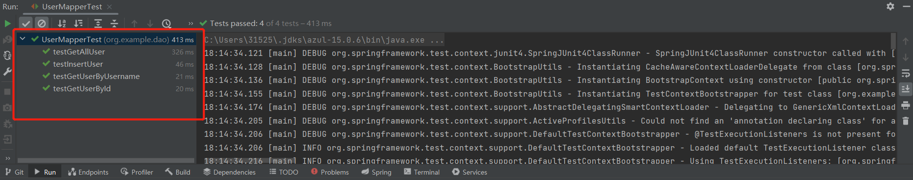

**1.2 ShipMapperTest**

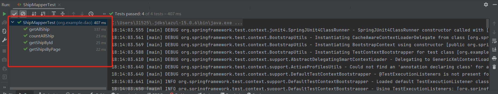

**1.3 OrderMapperTest**

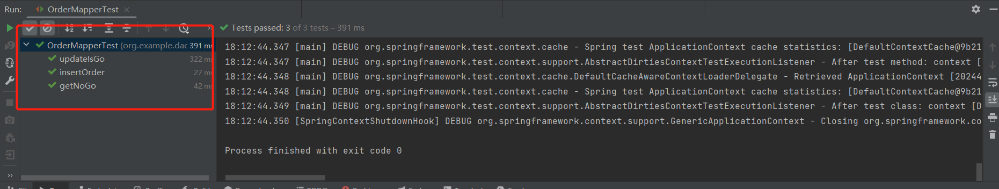

#### 2、Controller层集成测试Test结果

**1.1 UserControllerTest**

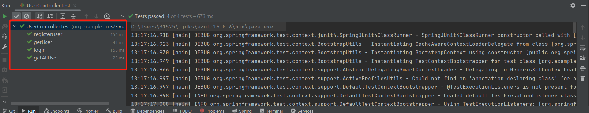

**1.2 ShipControllerTest**

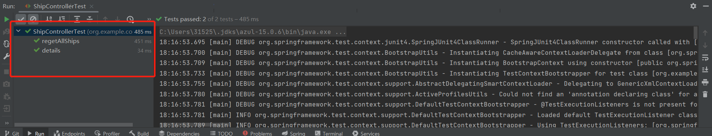

**1.3 OrderControllerTest**

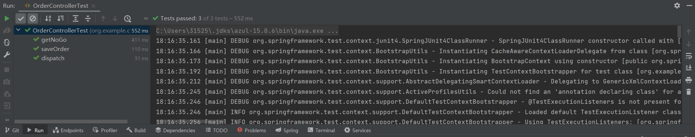


### 2、作业三、四

由于作业三四涉及到微服务交互，这里用JUnit进行repo层新增的测试，其余测试参看postman测试结果。具体代码见test目录

**user-server**

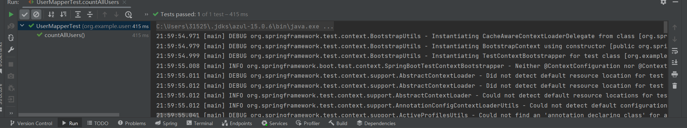

**ship-server**

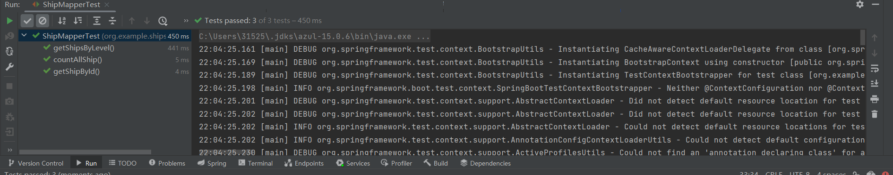

**order-server**

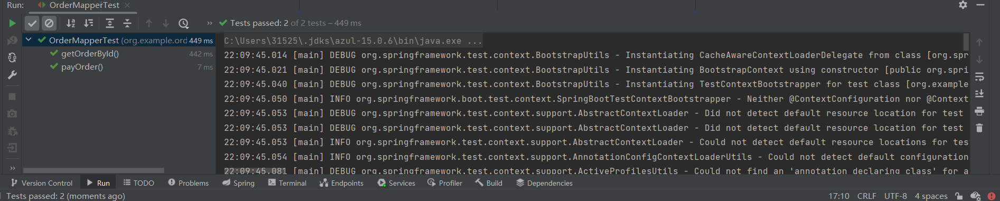

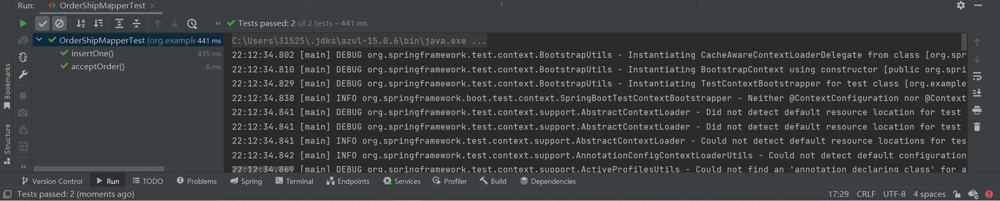

admin-server均调用其他微服务，无repo层。

## 四、Postman测试截图

此部分针对第三、四次作业外部接口使用postman进行测试，仅针对主流程。

### 

首先，进行登录，并获得token。

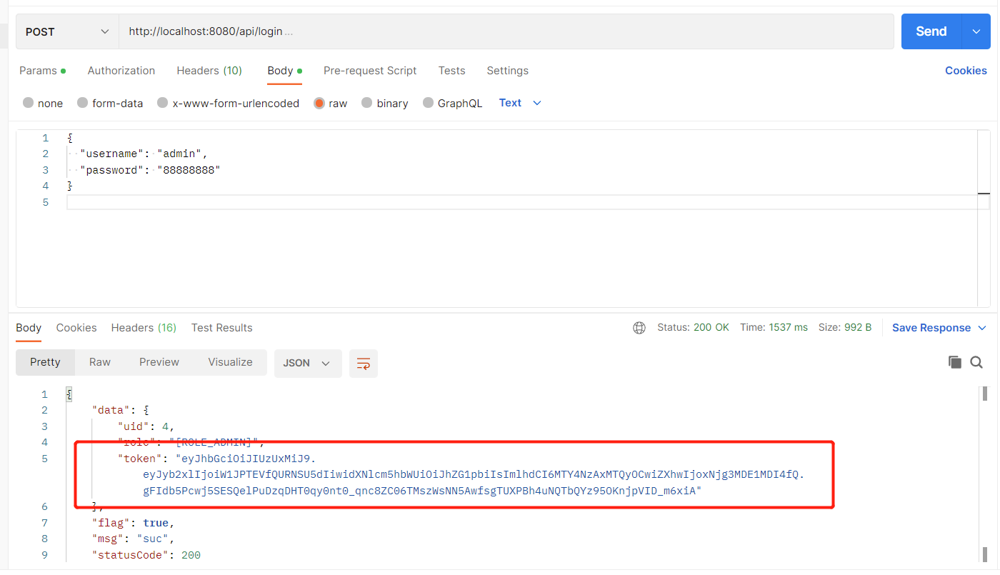

使用我们刚刚获取到的token，我们可以演示一下用户下单。

需要携带token：

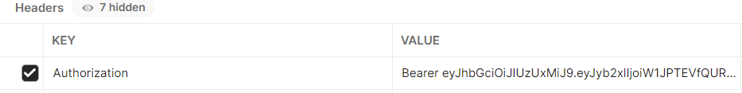

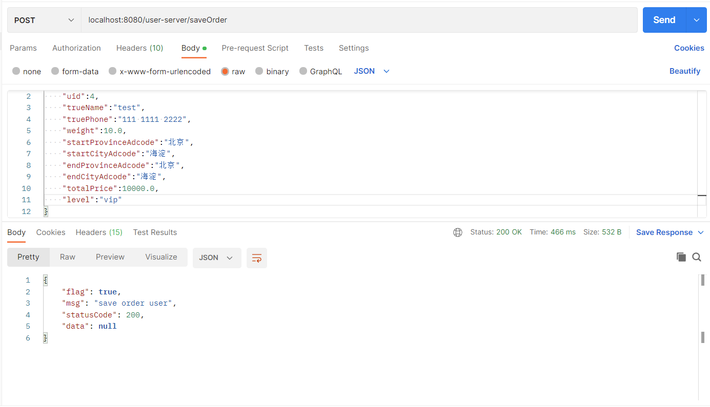

通过查看数据库，我们看到了我们刚刚下单的订单：

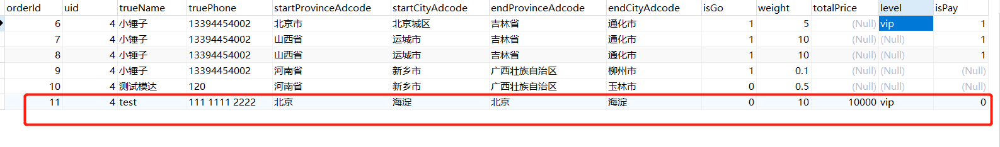

可以支付订单：


此时，管理员可通过订单id：11，level：vip，进行调派。


随后，船只可以接收调派：

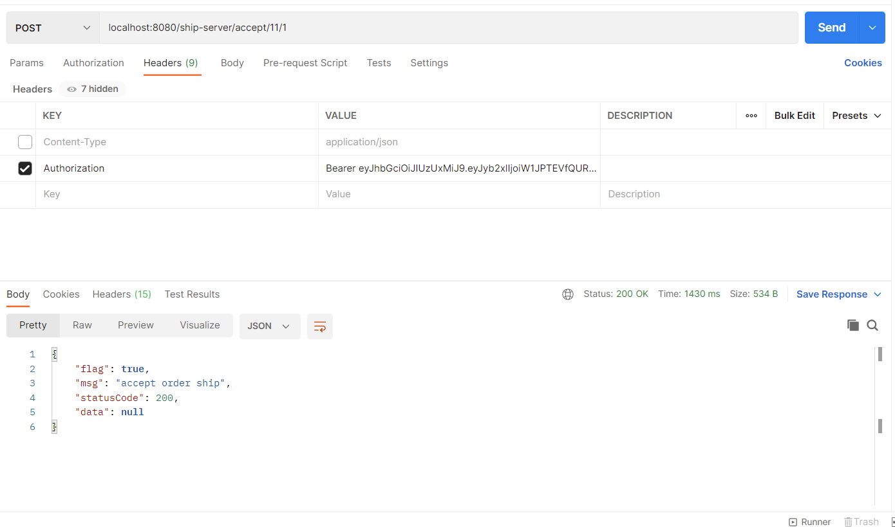

船只到达后，可以告知状态：

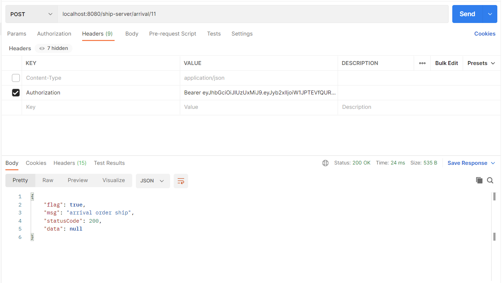

用户点击接收，完成订单：

发现了服务降级：

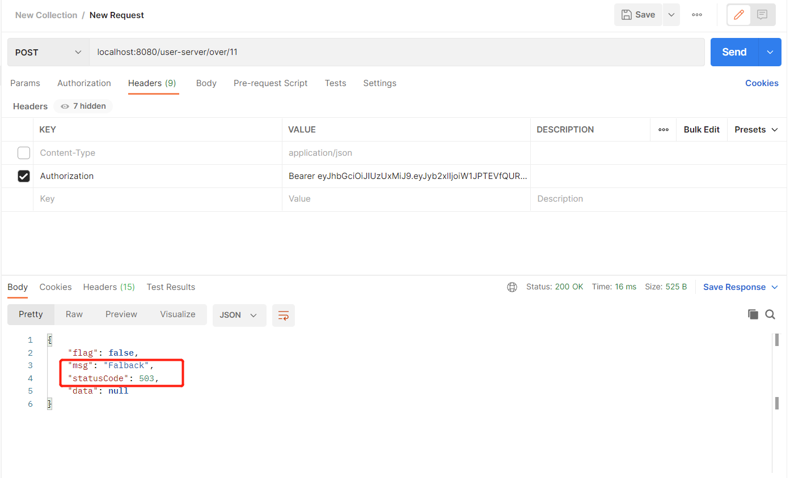

原因：url多打了”/“：


修正后：

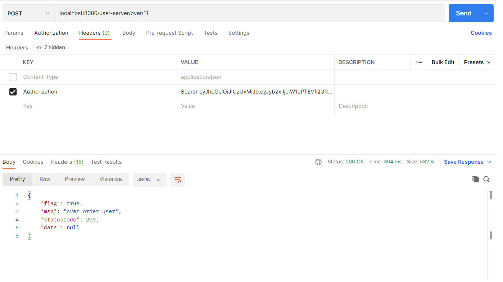

至此，主流程结束。

## 五、项目运行说明

1、除pom.xml中配置的各项版本外，运行项目还需要：

- Nacos 2.0.3

- kafka 2.4.0.RELEASE

- zookeeper kafka携带版

  上述所提压缩包均已经上传至master分支。

2、如项目出现

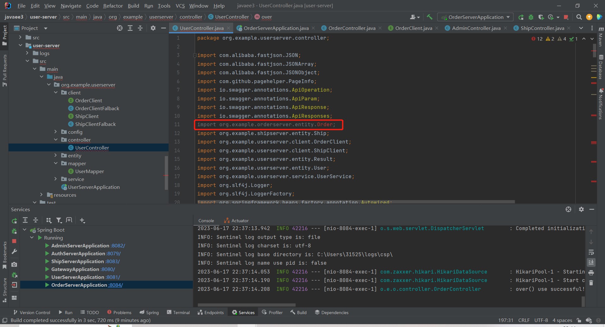

此类找不到别的module下文件报错，可以进行如下配置恢复：

File->Project Structure->Modules->对应的server->Dependencies-> <Module source> -> + ->选择需要的server并应用

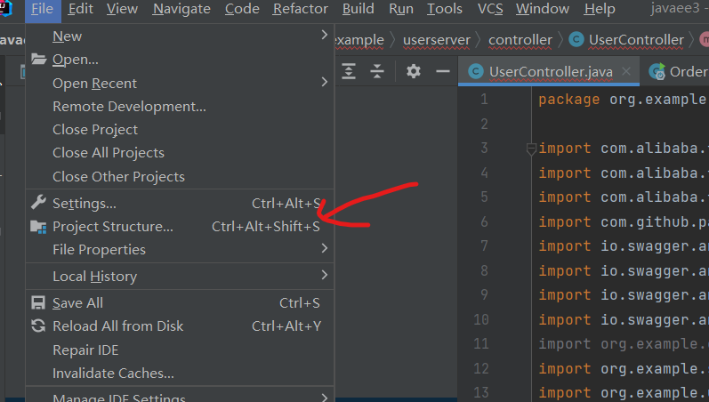

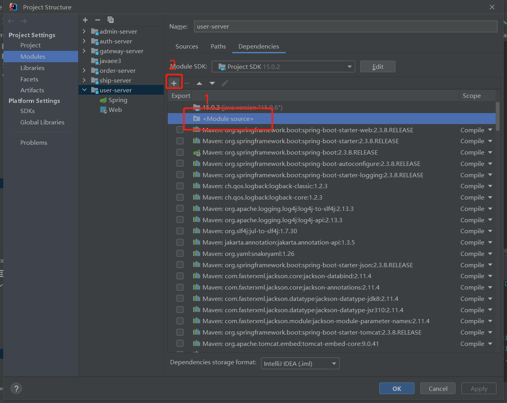

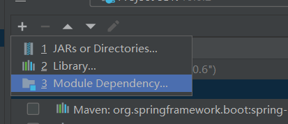

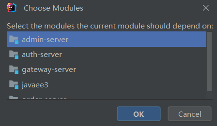

选择需要的模块并ok、apply、ok即可。

3、感谢所学，收获颇多。

  


